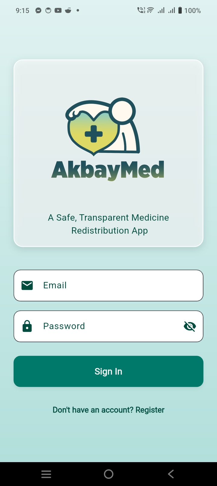
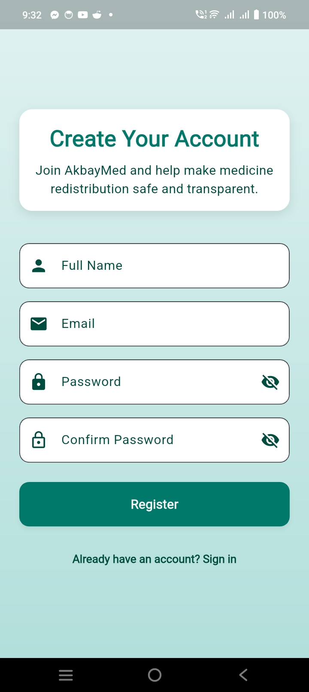
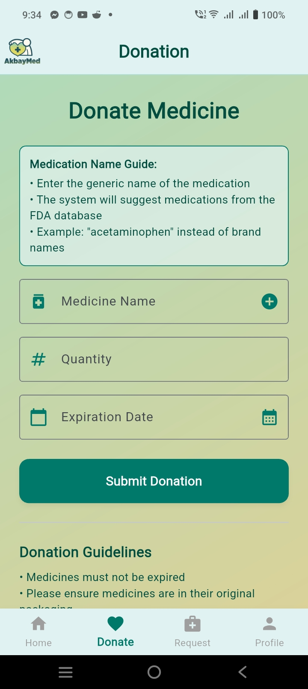
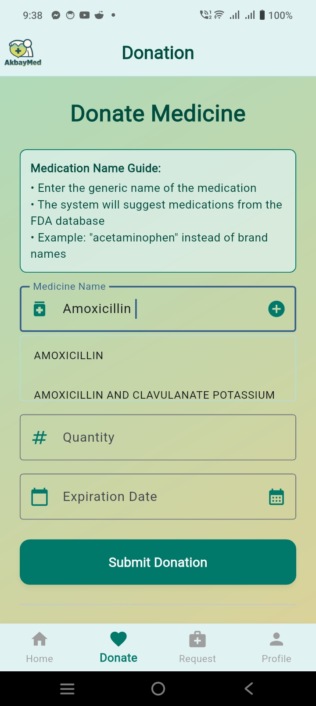
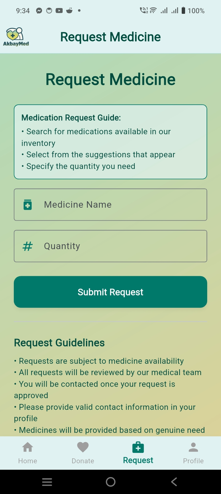
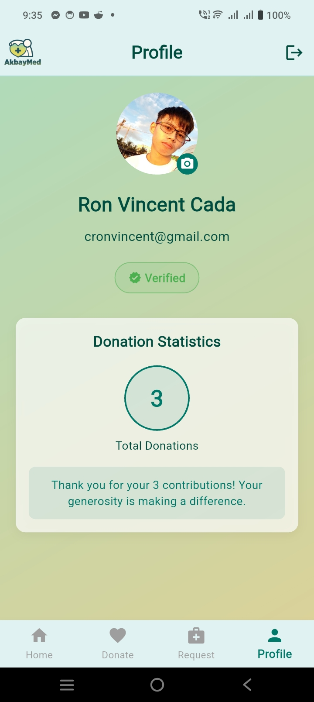
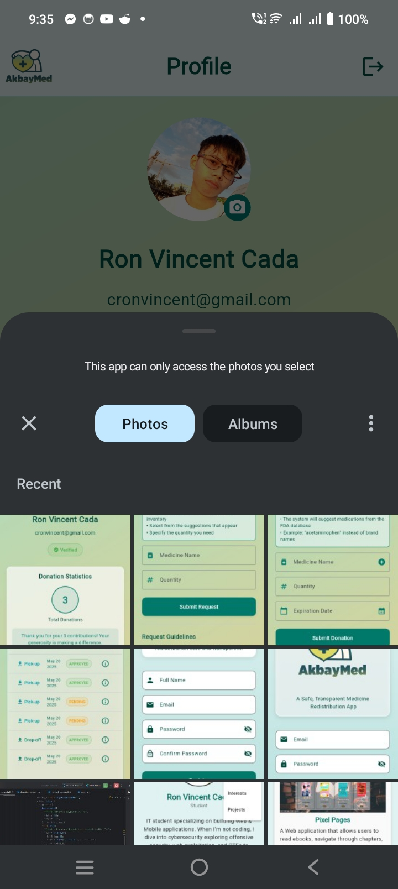
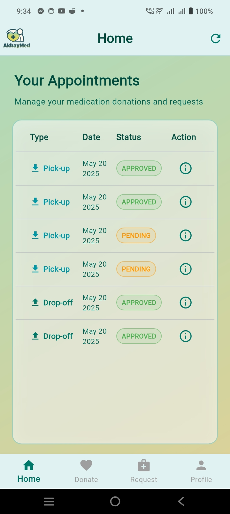
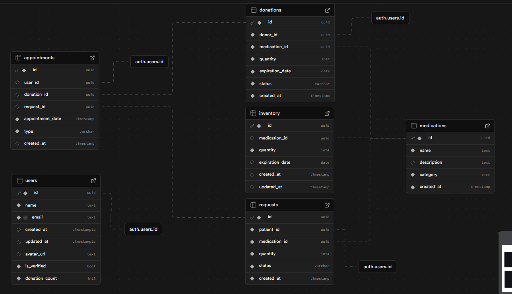

# AkbayMed

<div id="logo" align="center">
  
</div>

A Flutter-based Android application designed to facilitate medication donation and distribution in Philippine healthcare centers. The app connects donors with patients in need, ensuring safe and transparent medicine redistribution.

## Table of Contents
- [AkbayMed](#akbaymed)
  - [Table of Contents](#table-of-contents)
  - [Features](#features)
    - [Authentication](#authentication)
    - [Medication Donation](#medication-donation)
    - [Medication Requests](#medication-requests)
    - [User Profile](#user-profile)
    - [Home Dashboard](#home-dashboard)
  - [Tech Stack](#tech-stack)
    - [Frontend](#frontend)
    - [Backend](#backend)
    - [Dependencies](#dependencies)
  - [Installation](#installation)
  - [Project Structure](#project-structure)
  - [API Integration](#api-integration)
    - [openFDA API](#openfda-api)
    - [Supabase Integration](#supabase-integration)
  - [Database Schema](#database-schema)
    - [Users Table](#users-table)
    - [Medications Table](#medications-table)
    - [Donations Table](#donations-table)
    - [Requests Table](#requests-table)
    - [Inventory Table](#inventory-table)
    - [Appointments Table](#appointments-table)
    - [Table Relationships](#table-relationships)
    - [Key Features](#key-features)
    - [Database Functions and Triggers](#database-functions-and-triggers)
      - [Donation Count Management](#donation-count-management)
      - [Donation Appointment Management](#donation-appointment-management)
      - [Request Appointment Management](#request-appointment-management)
      - [Inventory Management](#inventory-management)
        - [Request Inventory Update](#request-inventory-update)
        - [Donation Inventory Update](#donation-inventory-update)
    - [Storage Configuration](#storage-configuration)
      - [Avatar Storage](#avatar-storage)
      - [Integration with App](#integration-with-app)
    - [Trigger Implementation Details](#trigger-implementation-details)
    - [Error Handling](#error-handling)
  - [UI/UX Design](#uiux-design)
    - [Design System](#design-system)
    - [Color Scheme](#color-scheme)
  - [Development Setup](#development-setup)
  - [Contributing](#contributing)
  - [License](#license)
  - [Acknowledgments](#acknowledgments)

## Features

### Authentication
Secure and user-friendly authentication system for both donors and patients.

<div align="center">
  
  
</div>

- Email and password-based authentication
- User registration with role selection
- Secure session management
- Profile management with avatar upload

### Medication Donation
Streamlined process for donors to contribute medications to those in need.

<div align="center">
  
  
</div>

- Donation submission with medication details
- Integration with openFDA API for medication verification
- Expiration date tracking
- Donation history and status tracking

### Medication Requests
Easy-to-use interface for patients to request needed medications.

<div align="center">
  
</div>

- Browse available medications
- Submit medication requests
- Track request status
- View request history

### User Profile
Personalized user experience with comprehensive profile management.

<div align="center">
  
  
</div>

- View and edit personal information
- Track donation/request history
- Update profile picture
- Manage account settings

### Home Dashboard
Centralized hub for all user activities and quick access to features.

<div align="center">
  
</div>

- Personalized welcome screen
- Activity tracking
- Quick access to main features
- Recent transactions overview

## Tech Stack

### Frontend
- **Framework**: Flutter 3.29.3
- **Language**: Dart 3.7.2
- **UI Components**: Material 3
- **State Management**: Flutter's built-in StatefulWidget
- **Navigation**: Flutter Navigator 2.0

### Backend
- **Authentication**: Supabase Auth
- **Database**: Supabase PostgreSQL
- **Storage**: Supabase Storage
- **API Integration**: 
  - openFDA API for medication information
  - RESTful API architecture

### Dependencies
```yaml
dependencies:
  flutter:
    sdk: flutter
  supabase_flutter: ^2.9.0
  flutter_dotenv: ^5.2.1
  logger: ^2.5.0
  image_picker: ^1.0.4
  path: ^1.8.3
  permission_handler: ^11.0.0
  http: ^1.4.0
  intl: ^0.19.0
```

## Installation

1. **Prerequisites**
   - Flutter SDK 3.x
   - Android Studio / VS Code
   - Android SDK (API level 26+)
   - Git

2. **Setup Steps**
   ```bash
   # Clone the repository
   git clone https://github.com/lucifron28/AkbayMed_User.git
   cd AkbayMed_User

   # Install dependencies
   flutter pub get

   # Create .env file
   cp .env.example .env
   ```

3. **Environment Configuration**
   Create a `.env` file in the root directory with:
   ```
   SUPABASE_URL=your_supabase_url
   SUPABASE_ANON_KEY=your_supabase_anon_key
   ```

4. **Run the App**
   ```bash
   flutter run
   ```

## Project Structure

```
lib/
├── main.dart           # Application entry point
├── app.dart            # Main app configuration
└── screens/           # UI screens
    ├── home_screen.dart
    ├── login_screen.dart
    ├── registration_screen.dart
    ├── donation_screen.dart
    ├── request_screen.dart
    └── profile_screen.dart
```

## API Integration

### openFDA API
- Endpoint: `https://api.fda.gov/drug/label.json`
- Used for medication verification and information
- Implements rate limiting and error handling

### Supabase Integration
- Authentication
- Real-time database
- File storage
- Row Level Security (RLS) policies

## Database Schema

<div align="center">
  
</div>

### Users Table
```sql
CREATE TABLE users (
    id UUID PRIMARY KEY REFERENCES auth.users(id),
    name TEXT NOT NULL,
    email TEXT NOT NULL,
    created_at TIMESTAMP WITH TIME ZONE DEFAULT NOW(),
    updated_at TIMESTAMP WITH TIME ZONE DEFAULT NOW(),
    avatar_url TEXT,
    is_verified BOOLEAN NOT NULL DEFAULT TRUE,
    donation_count BIGINT NOT NULL DEFAULT 0
);
```

### Medications Table
```sql
CREATE TABLE medications (
    id UUID PRIMARY KEY DEFAULT uuid_generate_v4(),
    name TEXT NOT NULL,
    description TEXT,
    category TEXT NOT NULL,
    created_at TIMESTAMP WITHOUT TIME ZONE NOT NULL DEFAULT NOW()
);
```

### Donations Table
```sql
CREATE TABLE donations (
    id UUID PRIMARY KEY DEFAULT uuid_generate_v4(),
    donor_id UUID NOT NULL REFERENCES users(id),
    medication_id UUID NOT NULL REFERENCES medications(id),
    quantity INTEGER NOT NULL,
    expiration_date DATE NOT NULL,
    status VARCHAR NOT NULL DEFAULT 'approved',
    created_at TIMESTAMP WITHOUT TIME ZONE NOT NULL DEFAULT NOW()
);
```

### Requests Table
```sql
CREATE TABLE requests (
    id UUID PRIMARY KEY DEFAULT uuid_generate_v4(),
    patient_id UUID NOT NULL REFERENCES users(id),
    medication_id UUID NOT NULL REFERENCES medications(id),
    quantity INTEGER NOT NULL,
    status VARCHAR NOT NULL DEFAULT 'approved',
    created_at TIMESTAMP WITHOUT TIME ZONE NOT NULL DEFAULT NOW()
);
```

### Inventory Table
```sql
CREATE TABLE inventory (
    id UUID PRIMARY KEY DEFAULT uuid_generate_v4(),
    medication_id UUID REFERENCES medications(id),
    quantity INTEGER NOT NULL DEFAULT 0,
    expiration_date DATE,
    created_at TIMESTAMP WITHOUT TIME ZONE DEFAULT NOW(),
    updated_at TIMESTAMP WITHOUT TIME ZONE DEFAULT NOW()
);
```

### Appointments Table
```sql
CREATE TABLE appointments (
    id UUID PRIMARY KEY DEFAULT uuid_generate_v4(),
    user_id UUID REFERENCES users(id),
    donation_id UUID REFERENCES donations(id),
    request_id UUID REFERENCES requests(id),
    appointment_date TIMESTAMP WITHOUT TIME ZONE NOT NULL,
    type VARCHAR NOT NULL,
    created_at TIMESTAMP WITHOUT TIME ZONE DEFAULT NOW()
);
```

### Table Relationships
- **Users** (1) → (N) **Donations**: One user can make multiple donations
- **Users** (1) → (N) **Requests**: One user can make multiple requests
- **Users** (1) → (N) **Appointments**: One user can have multiple appointments
- **Medications** (1) → (N) **Donations**: One medication can be donated multiple times
- **Medications** (1) → (N) **Requests**: One medication can be requested multiple times
- **Medications** (1) → (1) **Inventory**: One medication has one inventory record
- **Donations** (1) → (N) **Appointments**: One donation can have multiple appointments
- **Requests** (1) → (N) **Appointments**: One request can have multiple appointments

### Key Features
- UUID primary keys for all tables
- Automatic timestamp management for created_at and updated_at
- Foreign key constraints for referential integrity
- Default values for status fields
- Proper indexing on frequently queried columns
- Timestamp with time zone for user-related timestamps
- Timestamp without time zone for business logic timestamps

### Database Functions and Triggers

#### Donation Count Management
```sql
CREATE OR REPLACE FUNCTION increment_donation_count()
RETURNS TRIGGER AS $$
BEGIN
    IF (TG_OP = 'INSERT' AND NEW.status = 'approved') OR 
       (TG_OP = 'UPDATE' AND NEW.status = 'approved' AND OLD.status != 'approved') THEN
        UPDATE public.users
        SET donation_count = donation_count + 1
        WHERE id = NEW.donor_id;
    END IF;
    RETURN NEW;
END;
$$ LANGUAGE plpgsql;
```
**Purpose**: Automatically tracks and updates the donation count for users
- Triggers when a donation is approved
- Updates the user's donation_count in the users table
- Handles both new donations and status changes

#### Donation Appointment Management
```sql
CREATE OR REPLACE FUNCTION create_donation_appointment()
RETURNS TRIGGER AS $$
BEGIN
  IF (TG_OP = 'INSERT' AND NEW.status = 'approved')
     OR (TG_OP = 'UPDATE' AND NEW.status = 'approved' AND OLD.status != 'approved') THEN
    IF NOT EXISTS (
      SELECT 1 FROM appointments
      WHERE donation_id = NEW.id
    ) THEN
      INSERT INTO appointments (
        user_id,
        donation_id,
        appointment_date,
        type,
        created_at
      )
      VALUES (
        NEW.donor_id,
        NEW.id,
        CURRENT_TIMESTAMP + INTERVAL '3 days',
        'dropoff',
        NOW()
      );
    END IF;
  END IF;
  RETURN NEW;
END;
$$ LANGUAGE plpgsql;
```
**Purpose**: Automatically creates dropoff appointments for approved donations
- Creates appointments 3 days after donation approval
- Prevents duplicate appointments
- Links appointments to both users and donations

#### Request Appointment Management
```sql
CREATE OR REPLACE FUNCTION create_request_appointment()
RETURNS TRIGGER AS $$
BEGIN
  IF (TG_OP = 'INSERT' AND NEW.status = 'approved')
     OR (TG_OP = 'UPDATE' AND NEW.status = 'approved' AND OLD.status != 'approved') THEN
    IF NOT EXISTS (
      SELECT 1 FROM appointments
      WHERE request_id = NEW.id
    ) THEN
      INSERT INTO appointments (
        user_id,
        request_id,
        appointment_date,
        type,
        created_at
      )
      VALUES (
        NEW.patient_id,
        NEW.id,
        CURRENT_TIMESTAMP + INTERVAL '3 days',
        'pickup',
        NOW()
      );
    END IF;
  END IF;
  RETURN NEW;
END;
$$ LANGUAGE plpgsql;
```
**Purpose**: Automatically creates pickup appointments for approved requests
- Creates appointments 3 days after request approval
- Prevents duplicate appointments
- Links appointments to both users and requests

#### Inventory Management

##### Request Inventory Update
```sql
CREATE OR REPLACE FUNCTION update_inventory_from_request()
RETURNS TRIGGER AS $$
DECLARE
  total_available INTEGER;
  remaining_request INTEGER := NEW.quantity;
  rec RECORD;
BEGIN
  IF (TG_OP = 'INSERT' AND NEW.status = 'approved' AND NEW.medication_id IS NOT NULL)
     OR (TG_OP = 'UPDATE' AND NEW.status = 'approved' AND OLD.status != 'approved' AND NEW.medication_id IS NOT NULL) THEN
    SELECT COALESCE(SUM(quantity), 0) INTO total_available
    FROM inventory
    WHERE medication_id = NEW.medication_id
    AND (expiration_date IS NULL OR expiration_date >= CURRENT_DATE);

    IF total_available < NEW.quantity THEN
      RAISE EXCEPTION 'Insufficient inventory for medication_id %: requested %, available %',
        NEW.medication_id, NEW.quantity, total_available;
    END IF;

    FOR rec IN (
      SELECT id, quantity
      FROM inventory
      WHERE medication_id = NEW.medication_id
      AND (expiration_date IS NULL OR expiration_date >= CURRENT_DATE)
      AND quantity > 0
      ORDER BY COALESCE(expiration_date, '9999-12-31'::DATE) ASC
    ) LOOP
      IF remaining_request <= 0 THEN
        EXIT;
      END IF;
      DECLARE
        deduct_amount INTEGER := LEAST(remaining_request, rec.quantity);
      BEGIN
        UPDATE inventory
        SET quantity = quantity - deduct_amount,
            updated_at = NOW()
        WHERE id = rec.id;
        remaining_request := remaining_request - deduct_amount;
      END;
    END LOOP;
  END IF;
  RETURN NEW;
END;
$$ LANGUAGE plpgsql;
```
**Purpose**: Manages inventory levels when requests are approved
- Validates available inventory before processing
- Uses FIFO (First In, First Out) method for inventory management
- Considers expiration dates when allocating inventory
- Updates inventory quantities automatically
- Prevents over-allocation of medications

##### Donation Inventory Update
```sql
CREATE OR REPLACE FUNCTION update_inventory_from_donation()
RETURNS TRIGGER AS $$
DECLARE
  remaining_quantity INTEGER := NEW.quantity;
  rec RECORD;
BEGIN
  IF (TG_OP = 'INSERT' AND NEW.status = 'approved' AND NEW.medication_id IS NOT NULL)
     OR (TG_OP = 'UPDATE' AND NEW.status = 'approved' AND OLD.status != 'approved' AND NEW.medication_id IS NOT NULL) THEN
    INSERT INTO inventory (
      medication_id,
      quantity,
      expiration_date,
      source,
      donation_id,
      created_at,
      updated_at
    )
    VALUES (
      NEW.medication_id,
      NEW.quantity,
      NEW.expiration_date,
      'donation',
      NEW.id,
      NOW(),
      NOW()
    );
  END IF;
  RETURN NEW;
END;
$$ LANGUAGE plpgsql;
```
**Purpose**: Manages inventory levels when donations are approved
- Creates new inventory entries for approved donations
- Records medication quantity and expiration date
- Tracks donation source and reference
- Maintains inventory tracking
- Updates timestamps for tracking

### Storage Configuration

#### Avatar Storage
- **Bucket Name**: `avatars`
- **Purpose**: Stores user profile pictures
- **Configuration**:
  - Public access for viewing
  - Secure upload process
  - Automatic URL generation
  - File size limits and type restrictions

#### Integration with App
1. **Avatar Upload**:
   - User selects image in profile screen
   - Image is processed and compressed
   - Uploaded to Supabase Storage
   - URL stored in user's avatar_url field

2. **Avatar Display**:
   - Retrieved from storage using avatar_url
   - Cached for performance
   - Fallback to default avatar if not found

### Trigger Implementation Details

1. **Donation Count Trigger**
   - Event: AFTER INSERT OR UPDATE
   - Table: donations
   - Condition: status = 'approved'
   - Action: Increments user's donation_count

2. **Donation Appointment Trigger**
   - Event: AFTER INSERT OR UPDATE
   - Table: donations
   - Condition: status = 'approved'
   - Action: Creates dropoff appointment

3. **Donation Inventory Trigger**
   - Event: AFTER INSERT OR UPDATE
   - Table: donations
   - Condition: status = 'approved'
   - Action: Adds to inventory

4. **Request Appointment Trigger**
   - Event: AFTER INSERT OR UPDATE
   - Table: requests
   - Condition: status = 'approved'
   - Action: Creates pickup appointment

5. **Request Inventory Trigger**
   - Event: AFTER INSERT OR UPDATE
   - Table: requests
   - Condition: status = 'approved'
   - Action: Updates inventory quantities

### Error Handling
- Inventory validation before updates
- Exception handling for insufficient stock
- Duplicate appointment prevention
- Transaction management for data consistency

## UI/UX Design

### Design System
- Material 3 components
- Healthcare-focused color palette
- Accessible design elements
- Responsive layouts

### Color Scheme
- Primary: `#00796B` (Teal)
- Secondary: `#004D40` (Dark Teal)
- Background: `#E0F2F1` (Light Teal)
- Accent: `#B2DFDB` (Pale Teal)

## Development Setup

1. **IDE Configuration**
   - Install Flutter and Dart plugins
   - Configure Android SDK
   - Set up Flutter SDK path

2. **Code Style**
   - Follow Flutter style guide
   - Use Flutter lints
   - Implement proper error handling

3. **Testing**
   - Unit tests
   - Widget tests
   - Integration tests

## Contributing

1. Fork the repository
2. Create a feature branch
3. Commit your changes
4. Push to the branch
5. Create a Pull Request

## License

This project is licensed under the MIT License - see the LICENSE file for details.

## Acknowledgments

- Flutter team for the amazing framework
- Supabase for backend services
- openFDA for medication data
- All contributors and supporters
